# grafanacon-recap-2026-06
Photos and general information about the "GrafanaCON Recap" event, held in the city of Sao Paulo-SP.

Date: **06/13/2026 (Saturday)**

Organizers:
- **Renato Groffe (Microsoft MVP, Docker Captain, Grafana Champion, APIsec U Ambassador, MTAC)**
- **Tiago Moreira Vieira (Grafana)**
- **Adso Castro (Grafana Champion)**
- **Douglas Lima da Silva Martins (FIAP)**

Number of participants: **35 people**

I would like to express my gratitude to **Grafana Labs (Ewa Magiera, Shanna Gregory, Tiago Moreira Vieira)** and **FIAP (Andrea Paiva, Rubens Rodrigues, Douglas Lima da Silva Martins, Thiago Adriano, Gerson Osorio, Erica Carvalho, Michelle Cavalaro)** for all the support that made this event possible.

---

Presentations/talks that took place during the event:

_# Panel: Challenges of implementing Observability in current projects - from applications to infrastructure_

Participants:
- **Douglas Lima da Silva Martins (FIAP)**
- **Lucas Alixandre (FIAP)**
- **Adso Castro (Grafana Champion)**
- **Renato Groffe (Microsoft MVP, Docker Captain, Grafana Champion, APIsec U Ambassador MTAC)**

Technologies and topics covered: **OpenTelemetry, Prometheus, Grafana, Tempo, Loki, Microsoft Azure, Azure DevOps, Kubernetes, Docker, Containers, DevOps, Observability, Monitoring, Artificial Intelligence, LLMs, MCP, Security, Cybersecurity...**

_# GrafanaCON Recap: key updates in the Grafana stack_

Speaker: **Guilherme Caulada (Grafana Labs)**

Technologies and topics covered: **Grafana, Grafana Assistant, Tempo, Loki, Prometheus, OpenTelemetry, Artificial Intelligence, Software Development, Infrastructure, Containers, Kubernetes...**

_# FinOps in Practice: Cloud Cost Visibility_

Speakers:
- **Douglas Lima da Silva Martins (FIAP)**
- **Lucas Alixandre (FIAP)**

Technologies and topics covered: **FinOps, DevOps, Kubernetes, OpenCost, Prometheus, Observability, Monitoring, Artificial Intelligence...**

---

Access this [**link**](/img/) to view all photos from the presentations.

This event was a partnership between the [**Grafana & Friends Sao Paulo**](https://www.meetup.com/pt-br/grafana-and-friends-sao-paulo/) community and [**FIAP Pos Tech**](https://postech.fiap.com.br/).

Registration form used: [**Meetup**](https://www.meetup.com/pt-br/grafana-and-friends-sao-paulo/events/314558984/)

Location: **FIAP - Avenida Paulista, 1106 - 4th floor - Bela Vista - Sao Paulo/SP**

---

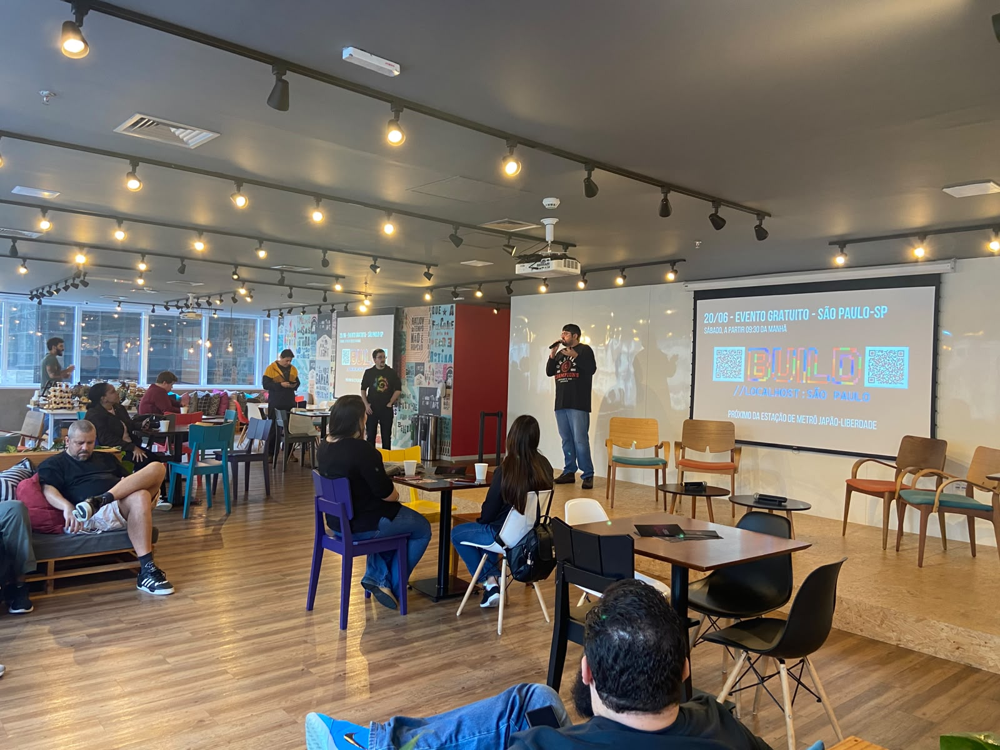

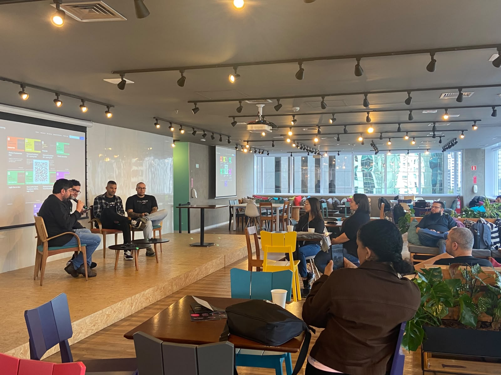

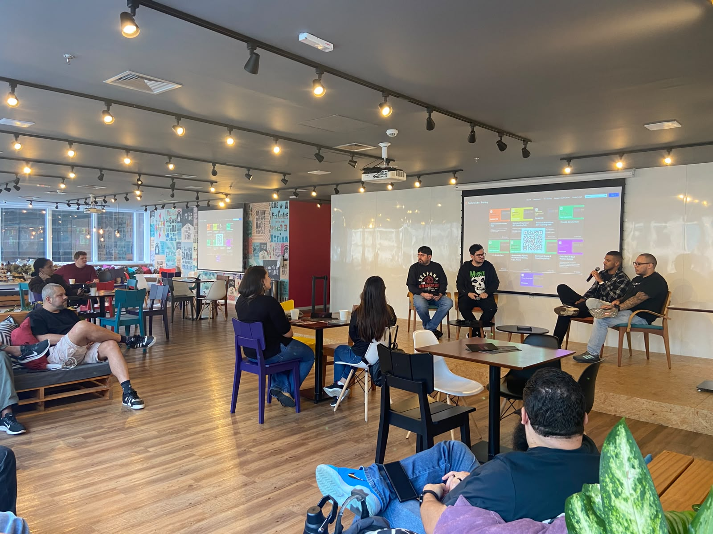

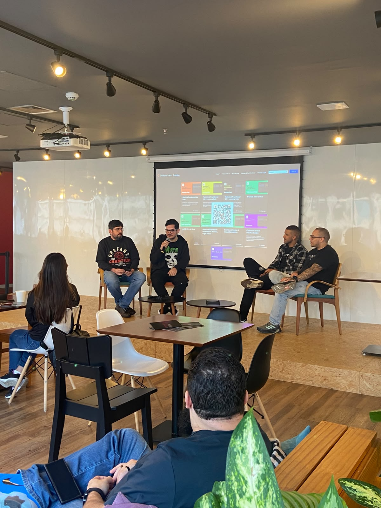

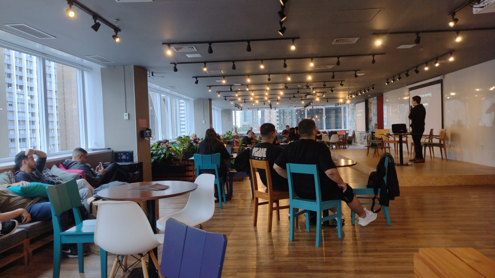

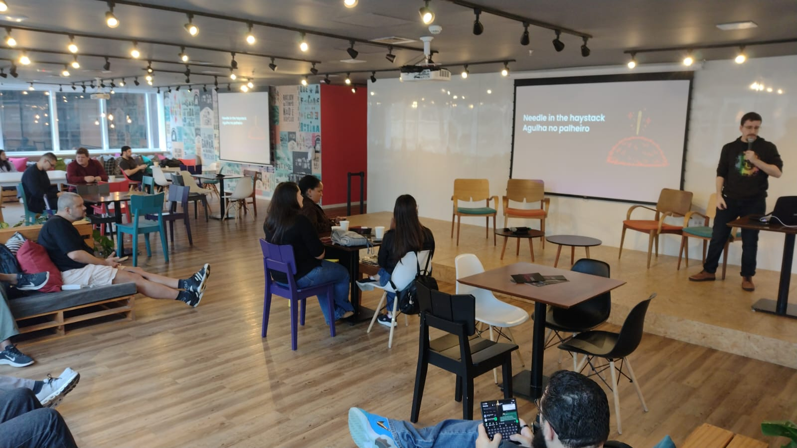

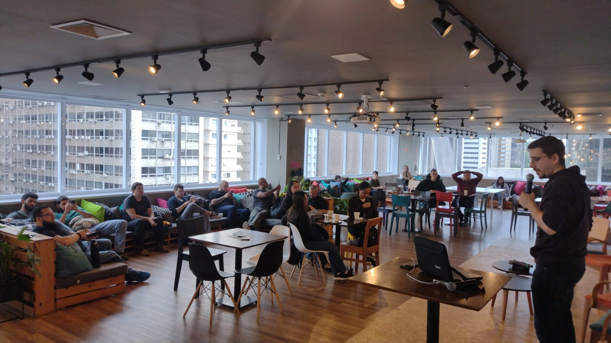

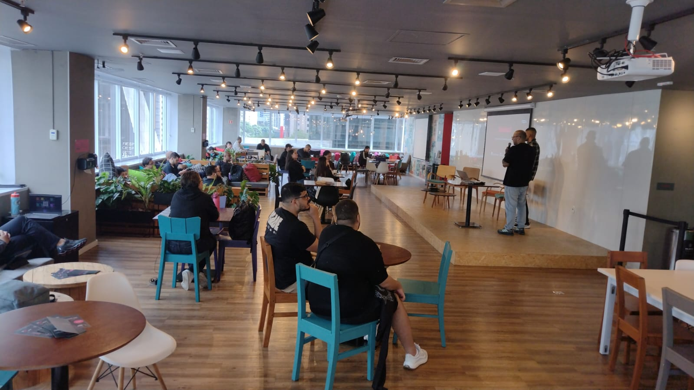

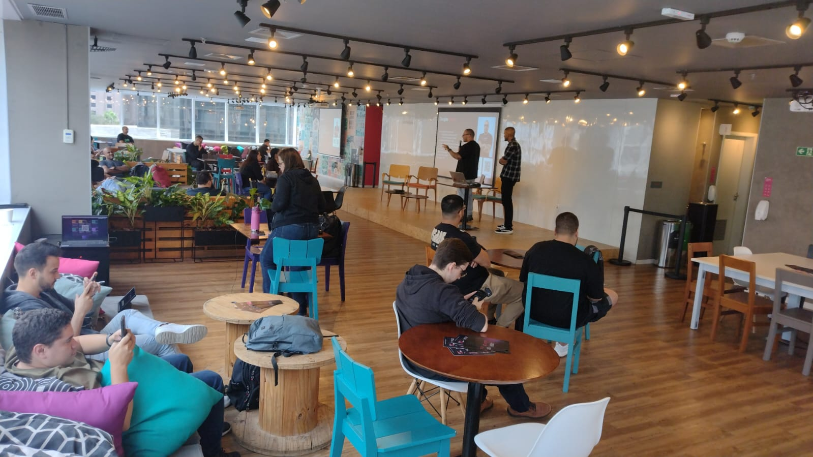

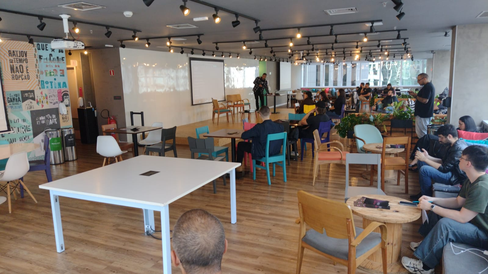

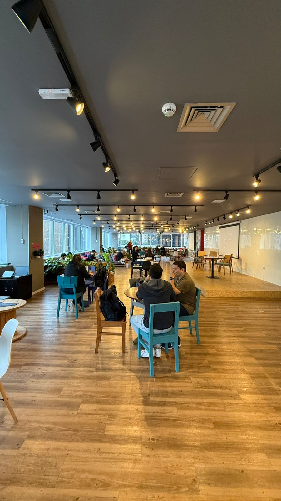

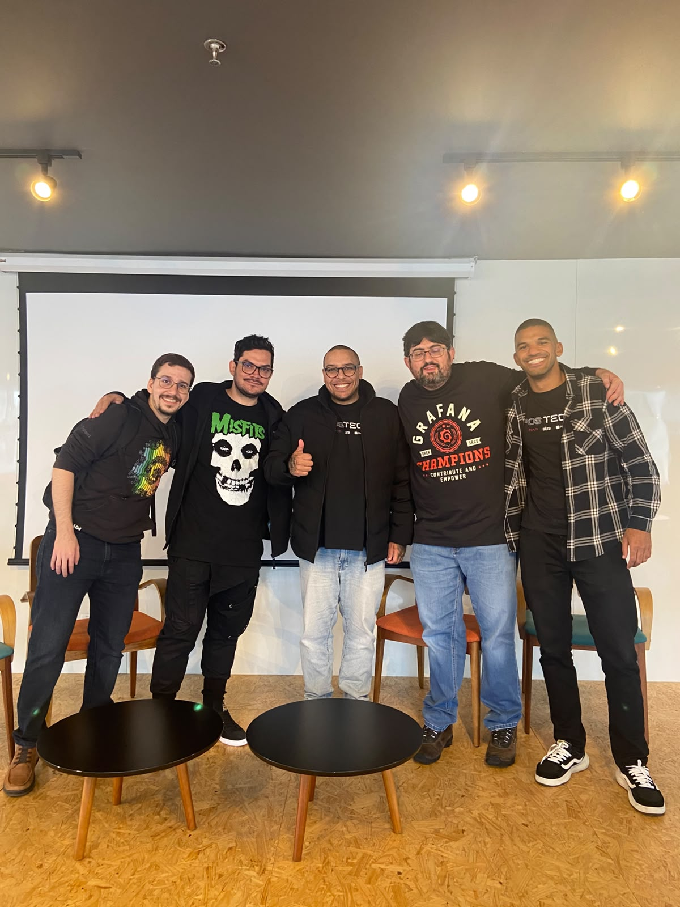
